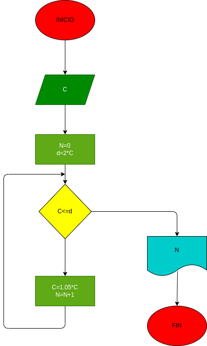

# interes-compuesto

hacer el diagrama de flujo y programa en python, que la un capital c, y que averigue e imprima en cuantos meses se duplica si lo colocamos a un interes compuesto de 5% mensual.

